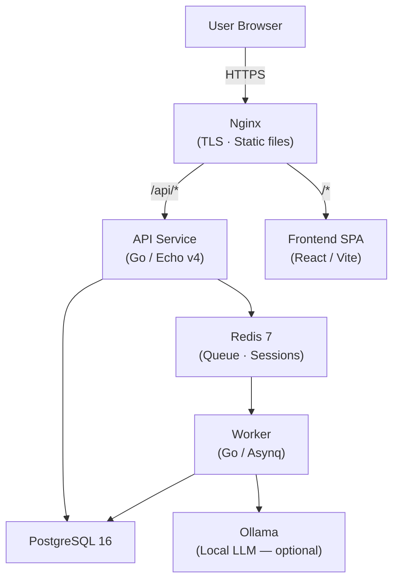

# Vakt

**Self-hosted Security & Compliance Platform — NIS2, ISO 27001, BSI-Grundschutz, DORA, TISAX, EU AI Act. Deploy in 5 minutes.**


**[Live Demo](https://secdemo.norvikops.de)** — ephemeral credentials, auto-generated, expires after 4 hours.

---

## What is Vakt?

Vakt is a self-hosted, source-available security and compliance platform built for SMEs in the DACH region. It helps IT teams implement and document NIS2, ISO 27001, BSI-Grundschutz, DORA, TISAX, and EU AI Act requirements — without sending any data outside your own infrastructure.

It is a free-to-self-host alternative to commercial tools like Vanta or Drata (~€10,000/year), licensed under the Elastic License 2.0. Deploy it with a single `docker compose up` command — the platform is **ready in under 5 minutes**. The bundled local AI advisor takes a bit longer on first start because it downloads the ~1.9 GB `qwen2.5:3b` model — depending on your bandwidth, expect an extra **3–30 minutes** until AI features are available. The platform itself works without waiting for the model.

---

## Modules

| Module | Description |
|---|---|
| 📊 **Vakt Comply** | Compliance hub: control tracking, gap analysis, risk register, incident register, policy templates (10 German templates), auditor portal, audit package export (ZIP), AI-generated reports, NIS2 registration wizard, Trust Center |
| 🔍 **Vakt Scan** | Scanner orchestration: Trivy, Nuclei, OpenVAS. Finding deduplication, SLA tracking, daily BSI CERT-Bund advisory feed, automatic evidence on resolved findings |
| 🔐 **Vakt Vault** | Secrets management: AES-256-GCM storage, Git repo scanning (gitleaks), automatic rotation, CI/CD integration |
| 📧 **Vakt Aware** | Security awareness: internal phishing simulations, micro-trainings, SMTP campaigns, anonymised reporting (Betriebsrats-konform), automatic evidence on training completion |
| 📋 **Vakt Privacy** | GDPR documentation hub: VVT (Art. 30), DPIA (Art. 35), AVV management (Art. 28), DSR workflows, breach notification records (Art. 33/34) |
| 👥 **Vakt HR** | Employee lifecycle management: onboarding and offboarding checklists, checklist runs per employee, employee directory with status tracking. Audit-ready evidence that access provisioning and revocation steps were completed. |

**Shared features across all modules:**

- Webhook alerting — Slack, Teams, generic webhooks with HMAC signing
- In-app notifications and weekly email digest
- Prometheus metrics endpoint
- Global search across all modules
- Data retention policies
- 2FA / TOTP
- Session management
- BSI CERT-Bund advisory feed
- Cross-module evidence automation (e.g. resolved findings and completed trainings flow into Vakt Comply)
- Admin CLI
- Public Trust Pages

---

## Quick Start

```bash
git clone https://github.com/norvik-ops/vatk
cd vatk
cp .env.example .env

# Generate a secure secret key (required):
sed -i 's/VAKT_SECRET_KEY=.*/VAKT_SECRET_KEY='"$(openssl rand -hex 32)"'/' .env

docker compose up -d
```

Open [http://localhost](http://localhost) in your browser.

> When `VAKT_DEMO=true` is set, the login screen automatically shows a set of fresh, ephemeral credentials. These credentials are randomly generated per session and expire after 4 hours — there are no static demo passwords.

> **Migrations** run automatically on every `docker compose up -d` — a dedicated `migrate` container applies all pending migrations before the API and worker start.

---

## System Requirements

| | Minimum | Recommended | With AI Advisor (default) |
|---|---|---|---|
| **CPU** | 2 vCPU | 4 vCPU | 4 vCPU — no GPU needed |
| **RAM** | 2 GB | 4 GB | 4 GB (+2 GB for model) |
| **Disk** | 20 GB SSD | 40 GB SSD | 40 GB SSD (+3 GB for model) |
| **Docker Engine** | 24+ | 24+ | 24+ |

The AI advisor runs locally via Ollama on CPU — no GPU, no cloud API key required, and **Community since v0.6.x** (no Pro license needed). Ollama starts automatically with `docker compose up`; an `ollama-init` container pulls the default model (`qwen2.5:3b`, Apache 2.0, ~1.9 GB RAM) on first launch — no manual `ollama pull` step. Other options: `llama3.2:1b` (smaller), `phi3.5:mini` (Microsoft, MIT), or Mistral EU API. To disable on small VMs: set `VAKT_AI_PROVIDER=disabled` and remove the `ollama`/`ollama-init` services via compose-override.

---

## Pro License

Vakt Community is free for self-hosting and includes the **AI advisor** out-of-the-box (since v0.6.x). Pro unlocks additional Premium-Compliance features:
- TISAX, DORA, EU AI Act, CRA compliance frameworks
- PDF audit exports and audit packages
- NIS2 reporting assistant
- SSO (OIDC/SAML) integration
- API access tokens
- Advanced scanner features (SBOM, EOL tracking)
- Advanced phishing simulation campaigns
- Supplier portal and granular module permissions

Purchase at [vakt.io/pricing](https://vakt.io/pricing). After purchase, enter your
license key in **Settings → License**.

---

## Configuration

The most important environment variables:

| Variable | Default | Description |
|---|---|---|
| `VAKT_DB_URL` | — | PostgreSQL connection string (required) |
| `VAKT_REDIS_URL` | — | Redis connection string (required) |
| `VAKT_SECRET_KEY` | — | 32-byte hex master encryption key (required) |
| `VAKT_MODULES_ENABLED` | all | Comma-separated list of enabled modules |
| `AUTO_MIGRATE` | `false` | Run DB migrations automatically on startup |
| `VAKT_DEMO` | `false` | Seed demo data and enable demo login |
| `VAKT_AI_PROVIDER` | — | AI provider (`openai` for OpenAI-compatible APIs) |
| `VAKT_AI_BASE_URL` | — | Base URL of the AI API |
| `VAKT_AI_API_KEY` | — | API key for the AI provider |
| `VAKT_AI_MODEL` | — | Model name (e.g. `mistral-small-latest`) |
| `VAKT_SMTP_HOST` | — | SMTP host for Vakt Aware campaigns |
| `VAKT_SMTP_PORT` | — | SMTP port |
| `VAKT_SMTP_USER` | — | SMTP username (required for port 587/465) |
| `VAKT_SMTP_PASS` | — | SMTP password (required for port 587/465) |
| `VAKT_SMTP_FROM` | — | From address for campaign emails |

See `docs/configuration.md` for the full reference.

---

## AI Compliance Advisor

Vakt includes a built-in AI advisor that analyses your organisation's real compliance gaps and answers "What should I do this week?" — specific to your data, running entirely on your server.

**Enabled by default** via a local Ollama container (CPU-only, no GPU, no API key, no Pro license). Default model is `qwen2.5:3b` (Apache 2.0, ~1.9 GB RAM, good German performance). The model is pulled automatically by the `ollama-init` container on first `docker compose up` — no manual step.

To switch to a different model:

```bash
docker compose exec ollama ollama pull phi3.5:mini
echo 'VAKT_AI_MODEL=phi3.5:mini' >> .env
docker compose restart api worker
```

**Model alternatives** (all CPU-only, choose based on your RAM budget):

| Model | RAM | License | Note |
|-------|-----|---------|------|
| `qwen2.5:3b` | 1.9 GB | Apache 2.0 | Default — fast, good DE |
| `llama3.2:1b` | 1.3 GB | Llama Comm. | Most economical |
| `llama3.2:3b` | 2.0 GB | Llama Comm. | Meta, balanced |
| `phi3.5:mini` | 2.3 GB | MIT | Microsoft, structured outputs |
| `gemma2:2b` | 1.6 GB | Gemma Terms | Google, more restrictive license |

To use a cloud provider instead (e.g. Mistral AI EU, OpenAI):

```env
VAKT_AI_BASE_URL=https://api.mistral.ai/v1
VAKT_AI_API_KEY=sk-...
VAKT_AI_MODEL=mistral-small-latest
```

To disable entirely: `VAKT_AI_PROVIDER=disabled`

---

## Architecture



All services run in Docker containers. No external dependencies. No phone-home.

---

## Development

```bash
# Backend — API server
cd backend && go run ./cmd/api

# Backend — background worker
cd backend && go run ./cmd/worker

# Frontend
cd frontend && npm install && npm run dev

# Admin CLI
cd backend && go run ./cmd/admin --help

# Tests and linting
make test
make lint
```

---

## Deployment

See [`docs/wiki/installation.md`](docs/wiki/installation.md) for:

- HTTPS with Let's Encrypt (included Nginx configuration)
- PostgreSQL backup strategies
- Kubernetes deployment via Helm chart (`/helm/vakt`)
- Upgrade procedure between versions

For MSPs deploying Vakt per customer, see [`docs/wiki/msp-onboarding.md`](docs/wiki/msp-onboarding.md).

### Key Links

| | |
|---|---|
| Live Demo | [secdemo.norvikops.de](https://secdemo.norvikops.de) |
| Product Site | [sec.norvikops.de](https://sec.norvikops.de) |
| CHANGELOG | [CHANGELOG.md](CHANGELOG.md) |
| Security | [SECURITY.md](SECURITY.md) |
| Getting Started | [docs/guides/getting-started.md](docs/guides/getting-started.md) |

---

## Contributing

Issues and pull requests are welcome.

- Run `make lint` before opening a PR
- Write tests for service-layer functions with domain invariants — especially auth, crypto, compliance, and migration logic (see ADR-0012)
- Do not commit secrets — use `.env.example` as a template
- Follow the module isolation rules described in `CLAUDE.md`

---

## License

[Elastic License 2.0 (ELv2)](LICENSE) — the source code is publicly available for reading and auditing. Self-hosting for your own organization is free and unrestricted. You may not offer Vakt as a hosted or managed service to third parties. No phone-home, no telemetry, no usage tracking of any kind.
